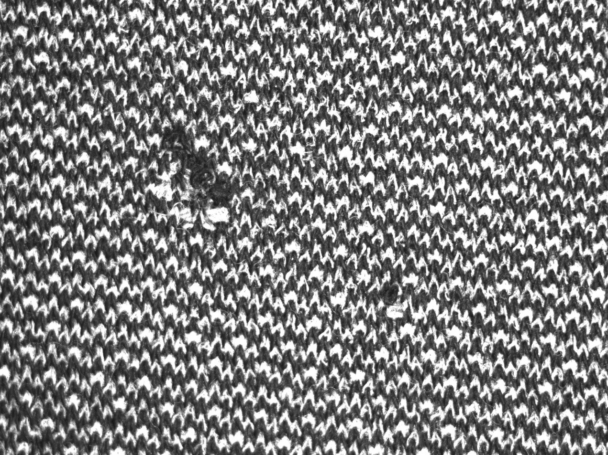
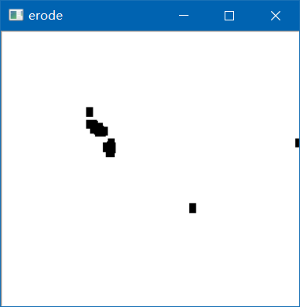
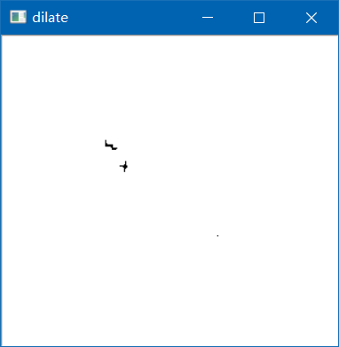
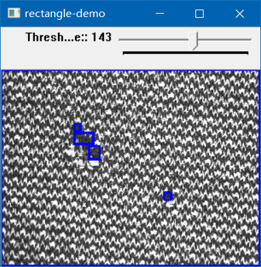
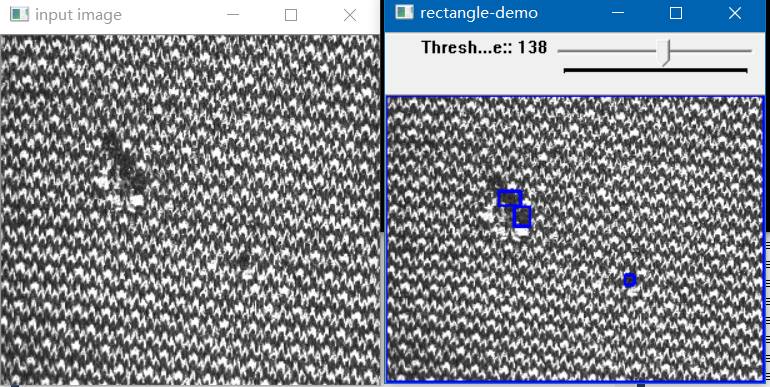

# 布匹瑕疵检测小思路
###真实生产环境中的一张样本图，该想法为本人拿到图片时的一个不需要太多计算且简单的一个想法！

> ## 原图

此图片为布匹在红外光相机照射下放大的一张样本图片

###需求
检测出布匹中的漏织小孔

###思路
将图片分割成若干个小正方形，每个正方形对象比对，通过调整正方形大小，来进行检测。详细思路不进行赘述，请阅读源代码。

> ## binary image

> ## erode

> ## dilate

> ## rectangle-demo

> ## 效果

